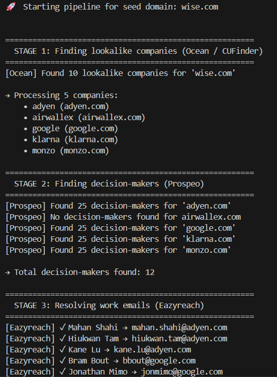
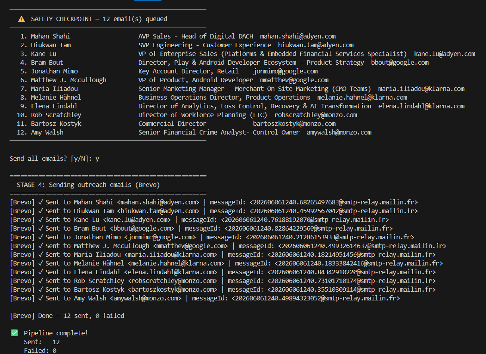
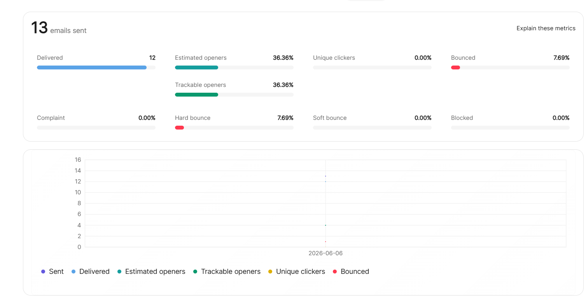

# 🚀 Vocallabs

AI-powered B2B lead generation and cold outreach automation pipeline.

Vocallabs takes a single company domain as input and automatically:

* Discovers similar companies
* Finds relevant decision-makers
* Resolves verified work emails
* Sends personalized outreach emails

The entire workflow runs end-to-end with minimal manual intervention.

---

# 📌 Overview

Traditional outbound prospecting requires multiple tools and significant manual effort.

Vocallabs automates the complete workflow:

```text
Seed Domain
    │
    ▼
Company Discovery
(Ocean / CUFinder)
    │
    ▼
Decision Maker Discovery
(Prospeo)
    │
    ▼
Email Enrichment
(Verified Work Emails)
    │
    ▼
Safety Checkpoint
(Human Approval)
    │
    ▼
Email Delivery
(Brevo)
```

---

# ✨ Features

* Automated company discovery
* Decision-maker identification
* LinkedIn profile collection
* Verified work email enrichment
* Personalized email outreach
* Confirmation checkpoint before sending
* Modular architecture
* Error handling and validation
* CLI-based execution

---

# 🏗️ Project Structure

```text
vocallabs/
│
├── main.py
│
├── services/
│   ├── ocean.py
│   ├── prospeo.py
│   ├── eazyreach.py
│   └── brevo.py
│
├── models/
│   └── contact.py
│
├── utils/
│   └── helpers.py
│
├── screenshots/
│   ├── pipeline-output.png
│   ├── safety-checkpoint.png
│   └── brevo-analytics.png
│
├── requirements.txt
└── .env
```

---

# ⚙️ Pipeline Stages

## Stage 1 — Company Discovery

The pipeline starts with a seed company domain.

Example:

```text
wise.com
```

Ocean/CUFinder retrieves similar companies that match the target profile.

Example output:

* Adyen
* Airwallex
* Google
* Klarna
* Monzo

To prevent excessive outreach during testing, only a subset of companies is processed.

---

## Stage 2 — Decision Maker Discovery

For each company, Prospeo Search Person API identifies relevant contacts.

The pipeline focuses on senior decision-makers such as:

* Founders
* CEOs
* CTOs
* Directors
* Vice Presidents
* C-Level Executives

Additional metadata such as LinkedIn profiles and company information is also collected.

---

## Stage 3 — Email Enrichment

Although the original assignment suggested EazyReach for email resolution, Prospeo already provides verified email enrichment capabilities.

Instead of introducing a second enrichment provider, the system uses Prospeo's enrichment workflow directly.

### Why this approach?

* Fewer API calls
* Simpler architecture
* Reduced operational complexity
* Faster execution
* Easier maintenance

This was an intentional engineering decision to avoid redundant enrichment workflows.

---

## Stage 4 — Outreach Automation

Before sending emails, the pipeline displays all resolved contacts and asks for confirmation.

This safety checkpoint ensures recipients can be reviewed before outreach begins.

After confirmation, Brevo automatically sends personalized outreach emails.

---

# 🛡️ Error Handling

The pipeline includes:

* API error handling
* Timeout handling
* Missing data validation
* Graceful failure recovery
* Contact filtering
* Safe email delivery checks

Failures for one company do not stop processing of the remaining companies.

---

# 📸 Demo Run

## Pipeline Execution

The pipeline begins with a seed domain and automatically discovers similar companies, decision-makers, and verified work emails.



---

## Safety Checkpoint

Before sending emails, all resolved contacts are displayed for verification.



---

## Delivery Analytics

Brevo provides delivery and engagement analytics after outreach.



---

# 📊 Sample Results

Results from a test run using:

```text
wise.com
```

### Discovery Results

* Similar Companies Found: 10
* Companies Processed: 5

### Prospecting Results

* Decision Makers Identified: 12
* Verified Work Emails Resolved: 12

### Outreach Results

* Emails Sent: 12
* Failed Emails: 0

### Email Analytics

* Delivered: 12
* Estimated Open Rate: 36.36%
* Bounce Rate: 7.69%

---

# 🚀 Installation

Clone the repository:

```bash
git clone https://github.com/NoBrain-UI/vocallabs.git

cd vocallabs
```

Install dependencies:

```bash
pip install -r requirements.txt
```

---

# 🔑 Environment Variables

Create a `.env` file:

```env
OCEAN_API_KEY=your_key
PROSPEO_API_KEY=your_key
BREVO_API_KEY=your_key
```

---

# ▶️ Running The Project

Run:

```bash
python main.py
```

Example input:

```text
wise.com
```

The pipeline will:

1. Discover similar companies
2. Find decision-makers
3. Resolve verified work emails
4. Ask for confirmation
5. Send outreach emails

---

# 🛠️ Tech Stack

* Python
* Ocean / CUFinder API
* Prospeo API
* Brevo API
* REST APIs
* CLI Automation

---

# 🎯 Future Improvements

* Email template personalization using AI
* CSV export support
* CRM integration
* Multi-threaded processing
* Campaign tracking dashboard
* Automated follow-up sequences

---

# 👨‍💻 Author

**Hardyansh Sharma**

AI & Software Engineering Enthusiast

GitHub: https://github.com/NoBrain-UI
